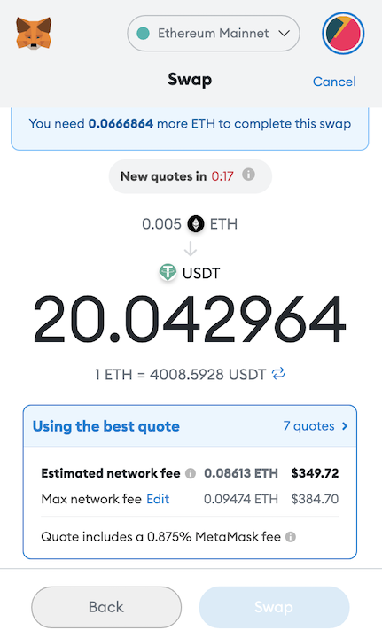
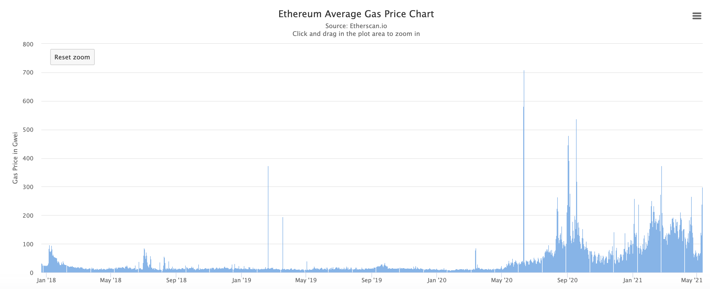
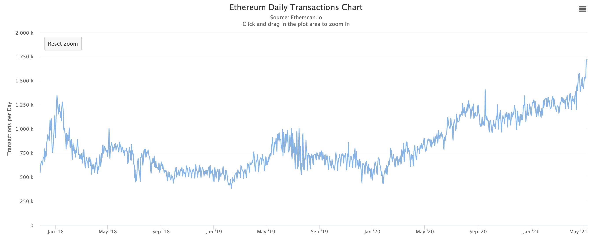
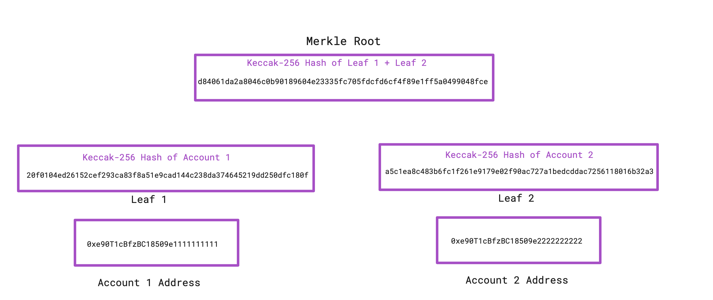

<br/>
<h1 style="font-weight: bold; text-align: center;">The Future of Ethereum Scaling: No More $300 Gas Fees</h1>
<br/>
<br/>

### **What’s the Ethereum gas issue?**
Lately, Ethereum (ETH) gas fees have skyrocketed, cutting into the pockets of transactors and completely blocking out some low-capital participants. For those who aren’t familiar, gas fees are fees paid to process a transaction on Ethereum, and they go up as network congestion grows. As an example, let’s say you wanted to swap .005 ETH (at the time of this writing, worth about $20) for USDT, which is equal to $1, through Uniswap. Uniswap is a DeFi application that allows you to, among other things, swap two Ethereum-based tokens. When I attempt to do this swap today, May 12th, 2021, this happens:
<br/>
<p align="center">
  
</p>
<br/>
That’ll be a $350 gas fee - insane. I would be at a net loss of about ~330 just to swap one token to another. To get a better picture of why this is, let's take a look at the Ethereum gas and daily transaction charts from 2018 to today:
<br/>
<br/>
<p align="center">
  
</p>
<br/>
<p align="center">
  
</p>
<br/>
<sub>Charts courtesy of https://etherscan.io</sub>
<br/>
<br/>
To clarify, gas prices on the first chart are denominated in Gwei; one Gwei is equal to 0.000000001 ETH. As we can see, daily transactions are trending upwards. So, as the network has to process more of these transactions, it must charge more Gwei as a gas fee to compensate miners, and each Gwei becomes more and more expensive in terms of dollars as the price of ETH continues to move up. So, when you want to swap tokens through Uniswap, which takes 10+ individual transactions, the gas fees start piling up.
<br/>
<br/>
Not only do current Ethereum scalability issues affect gas prices, they also affect transaction speed. This is clearly a problem, as Ethereum is home to many decentralized applications, NFTs, users, and developers. That’s where scaling solutions come in. 
<br/>
<br/>

### **Scaling solutions**
There are many proposed solutions to the Ethereum scaling issue. Some are already deployed, while others are still in development. Let’s go over a few prominent ones:
<br/>
- Layer 2 solutions such as zero-knowledge rollups. These seek to minimize on-chain transactions by adding, as you probably guessed from the name, another layer.
- Sidechains. These are separate blockchains that run in parallel to the main Ethereum chain, come with cheaper transaction costs, and allow assets to be moved on and off of them. They do, however, come with security risks because attacks on these, unlike layer 2 solutions, could result in stolen assets. Polygon provides an interesting side-chain-like solution that allows various deployed Ethereum-compatible chains to take in tokens through a bridge smart contract, process cheaper transactions, and still communicate with the Ethereum main chain with additional security. They also offer other scaling solutions.
- EIP1559. This will be released in a couple month’s time and features a new fee structure for gas.
- ETH 2.0. This actually involves changes to the Ethereum blockchain itself. Among the changes are a beacon chain (already active), proof of stake, and sharding. 

Now, let’s dive deeper into some of these.

### **ZK-rollups with ZK-STARKS**
Zero-knowledge rollups offer over 100x improved scalability by batching many transactions into one before sending it to the main Ethereum blockchain. Two popular zero-knowledge proofs used in these rollups are ZK-SNARKs (discussed in an [earlier article](http://beauhodes.com/articles/2021/03/31/zksnarks)) and ZK-STARKs. There are also other types of rollups such as optimistic rollups. For now, I'll focus on ZK-STARK based ZK-rollups. 

STARK based rollups have both on-chain, meaning on the Ethereum blockchain, and off-chain components. The on-chain component typically consists of proofs and two Merkle Trees: one for accounts and one for balances (see the picture below for an example of a Merkle Tree for accounts). The off-chain component is responsible for handling transactions, batching them, creating a STARK proof attesting to the validity of all transactions in the rollup, and sending the proof combined with the new Merkle Roots to the on-chain component.  

All funds are secured at the on-chain level, so an attack on the rollup could not steal them – a user can always withdraw by providing a path in the Merkle tree from their account to the root. Aside from less frequent on-chain updates due to batching, ZK-rollups save gas by publishing less data on-chain. Plus, they guarantee the validity of all on-chain commitments at the time of commitment, which sets ZK-rollups apart from optimistic rollups. 
<br/>
<p align="center">
  
</p>
<br/>
<sub>A small example of a Merkle Tree that uses the Keccak-256 hash function</sub>
<br/>
<br/>
I would like to take a short detour to discuss some key differences between STARK based ZK-rollups and SNARK based ZK-rollups. STARK proofs, unlike SNARKs, do not require a trusted setup phase. This means that there is never a chance for someone to learn the keys generated during trusted setup and create fake proofs. They are also post-quantum secure (referring to quantum computing) and require simpler cryptography than their SNARK counterparts. 
<br/>
<br/>

For all of these reasons, STARKs have been the proof of choice for applications such as dYdX, a popular decentralized exchange, and Immutable X, a layer 2 scaling solution for NFTs. Both of them use STARK based ZK-rollups powered by Starkware Industries, a company working on building better STARK based scaling solutions, and both feature 0 gas fees for users. To put the scaling effect of these rollups into perspective, Immutable X saved users over $400,000 on their first day using ZK-rollups. 
<br/>
<br/>
### **EIP1559**
EIP1559, an Ethereum Improvement Proposal coming this July as part of the London Hard Fork, will implement gas fee related changes to the Ethereum main chain. To understand the changes being made, it is important to have a basic understanding of Ethereum’s current gas pricing model. Basically, users submitting transactions are competing to be included in the next block. Blocks only have so much space, so when many transactions come in around the same time, gas fees shoot up. This is good for miners who benefit from increased fees, but not for users who want to transfer .005 ETH to 20 USDT during a time of network congestion.

In order to combat this, EIP1559 introduces the concepts of a “base fee” and a “priority fee”. The base fee moves according to network congestion using a preset algorithm. It is set algorithmically and constrained to certain values, so it can be reliably predicted (no more manually setting your gas fees for the most part) and cannot skyrocket at times of congestion. Most importantly, however, the base fee is burned. This means that, at times of congestion, ETH will become deflationary. Currently, Ethereum inflation sits at about 4.5% per year, but EIP1559 should cut this to under 1%. 

The priority fee can be thought of as a tip to miners, and it is also automatically set. Since the base fee is burned, this priority fee is the only thing that miners keep; hence, the outrage of some miners at the introduction of EIP1559. 

Additionally, EIP1559 contains a variable called ELASTICITY_MULTIPLIER, which is set to 2 and allows the maximum gas size per block to increase up to 2x its size (12.5 million gas to 25 million gas) during times of congestion, which should further help with throughput at these times. 

Let’s take a closer look at some of the EIP1559 code to see this in action:
<br/>
```python
priority_fee_per_gas = min(transaction.max_priority_fee_per_gas, transaction.max_fee_per_gas - block.base_fee_per_gas)
effective_gas_price = priority_fee_per_gas + block.base_fee_per_gas
signer.balance -= transaction.gas_limit * effective_gas_price
…
self.account(block.author).balance += gas_used * priority_fee_per_gas
```
<br/>

The first line takes the minimum of the tip offered to the miner (priority fee) and the difference between the maximum gas fee (specified by the user) and the current base fee. This ensures that the base fee is always paid first. Next, the full gas price is calculated by adding the priority fee we found in the last line and the current base fee. Then, in the third line, the user pays the gas fee. Finally, further down in the code (after the …,  which represents code that I left out), the miner is paid only the priority fee. 
<br/>
<br/>
### **ETH 2.0**
Lastly, we can't talk about future Ethereum scaling without mentioning the biggest change coming to Ethereum’s layer 1: ETH 2.0. This features, as stated before, a beacon chain, proof of stake, and eventually sharding.

To understand the beacon chain, we have to understand proof of stake and why it helps. Currently, Ethereum uses proof of work where miners compete to earn rewards for validating blocks using advanced hardware to quickly solve math problems in hopes that they will be first. This is simplifying the process, but that's basically the deal. Obviously, this takes a substantial amount of electricity, uses hardware that requires a lot of resources to produce, and pushes the companies that make the hardware to develop mining hardware rather than other products. 

Proof of stake is an alternative to proof of work that solves these problems. In proof of stake, token holders can “stake” their tokens (locking them up) to become a validator, help keep the network secure, and earn rewards. The idea here is that token holders do not want to see the token devalued, so it is in their best interest to be an honest validator. Non-honest validators also incur penalties.

The beacon chain, which is currently running parallel to the main proof of work Ethereum chain, gives stakers rewards come in the form of more ETH (for example, the priority fee we mentioned earlier). These rewards sit at about 7.4% APR right now, but that will go down as more stakers join in. You must own a minimum of 32 ETH to stake it, but staking pools aggregate ETH from members of the pool in order to allow those who hold less ETH to participate. 

Sometime in 2021 or 2022, the beacon chain will merge with the main chain and Ethereum will become a fully proof of stake blockchain. This merge will combine the beacon chain’s proof of stake with the main chain’s ability to execute smart contracts. This should also help reduce gas fees by reducing the time needed between blocks.
<br/>
<br/>
### **Sharding**
I figured sharding required its own section for three reasons. One, it is likely not coming til 2022 or later. Two, it is still in development, so the exact way it will look is not clear yet. Three, sharding will have a larger effect on scalability than EIP1559 or proof of stake. Now that that’s out of the way, what is sharding?

Sharding is essentially a way of splitting up the work of verifying blocks into “shards”, which can be thought of as separate validator nodes. The idea is to increase scalability by dividing up the amount of work that verifiers need to do. For Ethereum specifically, this will mean splitting it up amongst 64 shards, each with its own set of validators using proof of stake. The beacon chain gains additional jobs with sharding: facilitating data communication between shards, maintaining a common state between shards, and assigning validators to shards at random, which helps combat attacks on a single shard. 

How does the actual block verification process look with sharding? Each verifier would perform data availability sampling (link with details provided at end of article) on each block in order to verify that all data is available and can be recovered. This technique only requires verifiers to look at a subset of the data per block in order to verify that it is all there. Then, a zero knowledge proof would be done to attest to the validity of the transactions in the block.

As of right now, the plan is for shards to only provide data availability (for example, there would be no execution of smart contracts on the shards). 
At some point in the future, we could see execution happening on the shards, but that is much further away.

There are still technical hurdles related to sharding such as instant interoperability between applications on different shards, but it is without a doubt being worked on as you read this.
<br/>
<br/>
### **Summary**
Even with EIP1559 creating more predictable gas fees/burning ETH and proof of stake reducing the time between blocks, layer 2 solutions will continue to play the most pivotal role in Ethereum’s scalability (yes, even after sharding). This is commonly understood, and it is also why so many layer 2s are in development right now. If you’re looking to build an application on Ethereum, I would highly recommend looking at various layer 2s in order to reduce gas costs for users and provide faster throughput. 
<br/>
<br/>
### **ETH Competitors**
Ethereum does have its fair share of competitors, most of whom currently have miniscule gas fees. They do currently lack the network effects and development tools that Ethereum has, but they still see their fair share of volume. Notable competitors include Binance Smart Chain, Solana, Polkadot, and Cardano.
<br/>
<br/>
### **What's next?**
I plan to write an article about the good and the bad of flash loans next. It will cover use cases, the code required to execute one, and front-running in the mempool

### **Links/additional reading**
Github page for EIP1559<br/>
<https://github.com/ethereum/EIPs/blob/master/EIPS/eip-1559.md>
<br/>
<br/>

Great article that goes more in depth on sharding. It explains the data availability concept mentioned earlier<br/>
<https://vitalik.ca/general/2021/04/07/sharding.html>
<br/>
<br/>

Immutable X discussing their Starkware based ZK-rollups<br/>
<https://www.immutable.com/blog/design-architecture>
<br/>
<br/>

Further explanation on the beacon/main chain merge<br/>
<https://ethereum.org/en/eth2/merge/ >
<br/>
<br/>
